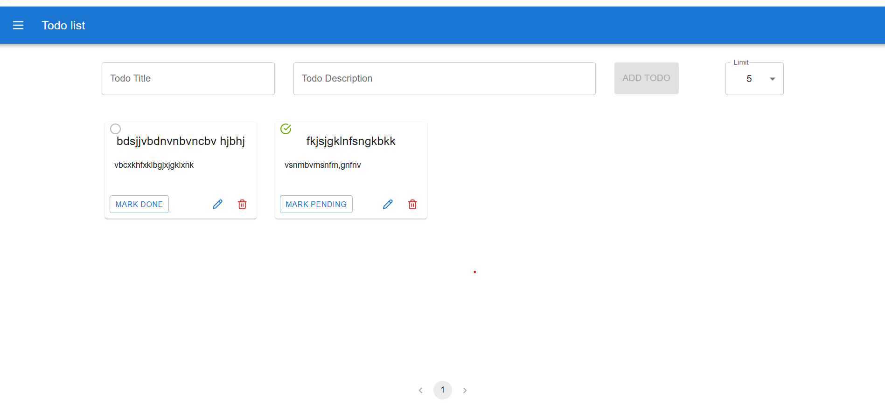

# Full-Stack Todo List Application

A full-stack Todo List web application that allows users to create, update, organize, and manage their tasks efficiently.  
The application is built with **React** on the frontend and **Node.js + Express** on the backend, with **MongoDB** for data persistence.

---

## 🚀 Demo

- **Frontend:** http://localhost:5173/
- **Backend API:** http://localhost:5000

---

## 🛠️ Technologies Used

### Frontend

- **React**
- **Vite**
- **Material UI (MUI)**
- **React Toastify**
- **Lucide Icons**

### Backend

- **Node.js**
- **Express.js**
- **MongoDB**
- **Mongoose**
- **dotenv**
- **Nodemon**

---

## 📁 Project Structure

The project is divided into two main parts:

- **Frontend**: Located in the `frontend/` directory with its own [README](frontend/README.md).
- **Backend**: Located in the `backend/` directory with its own [README](backend/README.md).

---

## ✨ Features

- Create, view, update, and delete todo items
- Edit todo title and description using a dialog
- Mark todos as completed or pending
- Pagination support
- Search todos by title
- Responsive UI for different screen sizes
- Real-time UI updates without page refresh
- Toast notifications for user actions

---

## 🔗 Backend API Endpoints

| Method | Endpoint             | Description                                |
| ------ | -------------------- | ------------------------------------------ |
| GET    | `/todos`             | Retrieve all todos (supports pagination)   |
| POST   | `/todos`             | Create a new todo                          |
| PUT    | `/todos/:id`         | Update a todo (title, description, status) |
| DELETE | `/todos/:id`         | Delete a todo                              |
| GET    | `/todos?title=TITLE` | Search todos by title                      |

---

## ⚙️ Environment Variables

### Backend (`Backend/.env`)

```env
PORT=5000
MONGO_URI=your_mongodb_connection_string
```

### Frontend (`Frontend/.env`)

```env
VITE_API_URL=http://localhost:5000
```

## 🧪 Run Locally

Follow the steps below to run the project on your local machine.

---

### 1️⃣ Clone the Repository

```bash
git clone https://github.com/your-username/fullstack-todolist.git
cd fullstack-todolist
```

### 2️⃣ Backend Setup

Navigate to the backend directory and install the required dependencies:

```bash
cd Backend
npm install
npm start
```

### 2️⃣ Frontend Setup

Navigate to the f directory and install the required dependencies:

```bash
cd Fronted
npm install
npm run dev
```

## Contributing

Contributions are welcome! See the specific README files in the `frontend/` and `backend/` directories for more details on contributing.

## Snapshots


